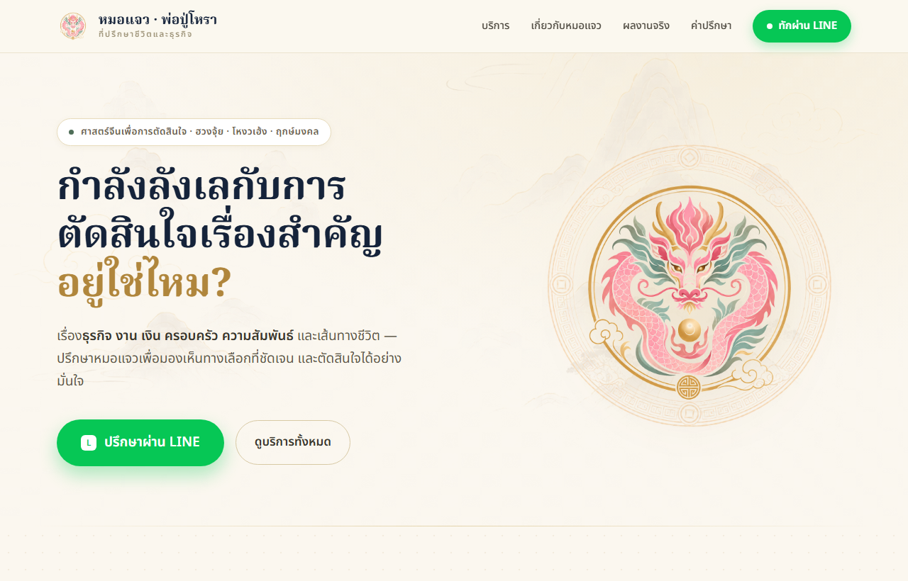
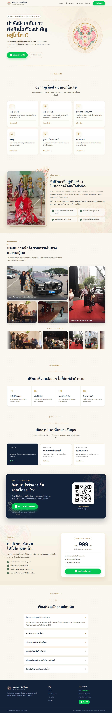

<div align="center">



<h1>🐉 หมอแจว · พ่อปู่โหรา</h1>

<p><strong>ที่ปรึกษาชีวิตและธุรกิจ ด้วยศาสตร์จีน · ฮวงจุ้ย · โหงวเฮ้ง · ฤกษ์มงคล</strong></p>

<p>Landing page ที่สร้างความน่าเชื่อถือ แล้วพาผู้สนใจไปปรึกษาต่อทาง LINE OA <code>@mohjaew</code><br/>(ปรึกษาส่วนตัวกับหมอแจว เริ่มต้น 999 บาท)</p>

<p>
  
  
  
  
</p>

</div>

---

## ✨ จุดเด่น (Features)

| | |
|---|---|
| 💬 **LINE-first** | ทุก CTA พาไป LINE OA — URL อยู่ที่เดียวใน `src/config/site.ts` |
| 🎴 **6 หัวข้อบริการ** | งาน·ธุรกิจ · เงิน · ความรัก·ครอบครัว · ฮวงจุ้ย · ดูดวง · ฤกษ์มงคล (กดการ์ดไป LINE ได้) |
| 🖼️ **แกลเลอรีผลงานจริง** | คอลลาจภาพการทำงาน + **Marquee** ภาพบรรยากาศเลื่อนอัตโนมัติ (CSS ล้วน) |
| 💰 **ราคาโปร่งใส** | แจ้งค่าปรึกษาชัดเจน เริ่มต้น 999 บาท ไม่มีบังคับซื้อของ |
| ❓ **FAQ accordion** | คำถามที่พบบ่อย แบบกดเปิด-ปิด |
| 🎨 **ดีไซน์อบอุ่น** | โทน ivory / navy / gold / green · ฟอนต์ Noto Serif & Sans Thai |

> ดีไซน์อิงต้นฉบับแบรนด์ (fixed 1200px desktop) — `src/pages/Home.tsx` คือหน้า Landing ทั้งหมดในไฟล์เดียว

<div align="center">
<details>
<summary><b>🖼️ ดูตัวอย่างหน้าเต็ม (Full page preview)</b></summary>
<br/>

</details>
</div>

---

## 🛠️ Tech stack

Vite + React + TypeScript, plain CSS + inline styles. ไม่มี UI framework และไม่มี router —
สองเส้นทาง (`/` และ `/booking`) จัดการด้วย pathname switch ใน `src/App.tsx`

## 🚀 เริ่มใช้งาน (Run locally)

```bash
npm install
npm run dev        # http://localhost:5173
```

| Script | ทำอะไร |
|--------|--------|
| `npm run dev` | dev server พร้อม HMR |
| `npm run build` | typecheck (`tsc -b`) + production build → `dist/` |
| `npm run preview` | เสิร์ฟไฟล์ที่ build แล้ว |
| `npm run typecheck` | เช็ก type อย่างเดียว |
| `npm run lint` | eslint |

## ⚙️ Configuration

ค่าแบรนด์ + LINE ทั้งหมดอยู่ที่ **`src/config/site.ts`** (single source of truth)
override ต่อ environment ได้ด้วยไฟล์ `.env` (ดู `.env.example`):

```bash
VITE_LINE_OA_ID=@mohjaew
VITE_LINE_URL=https://line.me/R/ti/p/@mohjaew
```

## 📁 Structure

```
public/
  assets/               ภาพแบรนด์ (มังกร, มันดาลา, ภูเขา, QR, ภาพกิจกรรม)
  gallery/              ภาพสำหรับ marquee (13 รูป)
src/
  config/site.ts        brand, LINE OA id/url, price, disclaimer
  pages/
    Home.tsx            ★ หน้า Landing ทั้งหมด (11 ส่วน, inline styles ตรงต้นฉบับ)
    Booking.tsx         /booking + /line-booking — placeholder สำหรับ Phase 2 (LIFF)
  components/           LineButton ฯลฯ (ส่วน Booking ใช้ต่อ)
  App.tsx               pathname → page (+ skeleton ตอนโหลด)
  index.css             global resets + ธีมสี (ivory/navy/gold/green)
docs/
  screenshots/          ภาพหน้าเว็บสำหรับ README
```

## 📌 Phase 2 — LINE LIFF booking (ยังไม่ได้ทำ)

`/booking` เป็น placeholder ที่ตอนนี้ลิงก์ไป LINE เฉย ๆ เมื่อย้ายการจองมาในแอป
ให้ต่อใน `src/pages/Booking.tsx` (มีคอมเมนต์อธิบายไว้): ลง `@line/liff`, เพิ่ม
`VITE_LIFF_ID`, เรียก `liff.init()` ตอน mount, render ฟอร์ม แล้วส่งไป backend

> **Static hosting:** `/booking` พึ่ง SPA fallback — บน static host ให้ rewrite ทุก path
> ไป `index.html` (เช่น Netlify `_redirects`, Vercel rewrites)

## 📝 Copy & compliance

ใช้ภาษาปลอดภัย (แนวทาง / มุมมอง / ชี้จังหวะ / ประกอบการตัดสินใจ) เลี่ยงคำรับประกัน
(แม่น 100% / รวยแน่นอน / รับประกันผลลัพธ์) — disclaimer ที่ต้องมีอยู่ใน
`src/config/site.ts` และแสดงที่ footer

<div align="center">
<sub>© 2569 หมอแจว · พ่อปู่โหรา — การปรึกษาเป็นแนวทางประกอบการตัดสินใจ มิใช่การรับประกันผลลัพธ์</sub>
</div>
